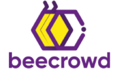

<h1 align="center">beecrowd / URI 🐝</h1>

 

  
  

Soluções de alguns exercícios da plataforma 
    <a href="https://www.beecrowd.com.br/">beecrowd</a>
    (antigo URI)

 

### Navegar por categoria

1. [Iniciante](https://github.com/heltonricardo/beecrowd-uri/tree/master/1-iniciante)
2. [Ad Hoc](https://github.com/heltonricardo/beecrowd-uri/tree/master/2-ad-hoc)
3. [Strings](https://github.com/heltonricardo/beecrowd-uri/tree/master/3-strings)
4. [Estruturas e Bibliotecas](https://github.com/heltonricardo/beecrowd-uri/tree/master/4-estruturas-e-bibliotecas)
5. [Matemática](https://github.com/heltonricardo/beecrowd-uri/tree/master/5-matematica)
6. [Paradigmas](https://github.com/heltonricardo/beecrowd-uri/tree/master/6-paradigmas)
7. [Grafos](https://github.com/heltonricardo/beecrowd-uri/tree/master/7-grafos)
8. [Geometria Computacional](https://github.com/heltonricardo/beecrowd-uri/tree/master/8-geometria-computacional)
9. [SQL](https://github.com/heltonricardo/beecrowd-uri/tree/master/9-sql)

### Navegar por linguagem

- [C](https://github.com/heltonricardo/beecrowd-uri/search?l=c)
- [C++](https://github.com/heltonricardo/beecrowd-uri/search?l=c%2B%2B)
- [Python](https://github.com/heltonricardo/beecrowd-uri/search?l=python)
- [MySQL](https://github.com/heltonricardo/beecrowd-uri/search?l=sql)

 

> [!WARNING]
>
> Os códigos disponíveis neste repositório são provenientes de uma fase anterior do meu aprendizado de programação. Gostaria de ressaltar que eles não representam as melhores práticas ou abordagens corretas de programação atualmente.
>
> Esses códigos foram escritos durante um período de aprendizado e podem conter erros ou não seguir os padrões atualmente aceitos. Eles são disponibilizados aqui apenas para fins acadêmicos e de estudo.
>
> Recomenda-se que você não utilize esses códigos como referência para projetos ou aplicações profissionais. Caso esteja procurando exemplos de código atualizados e melhores práticas de programação, sugiro buscar outras fontes confiáveis.
>
> Tenha em mente que desde a criação desses códigos, minha metodologia de programação evoluiu e adotei abordagens mais eficientes e alinhadas com as melhores práticas da indústria.
>
> Se tiver alguma dúvida ou precisar de exemplos mais atualizados, sinta-se à vontade para entrar em contato.
>
> Atenciosamente,  
> Helton.

##### [Link para o meu perfil no beecrowd 🤠](https://judge.beecrowd.com/pt/profile/47266)
